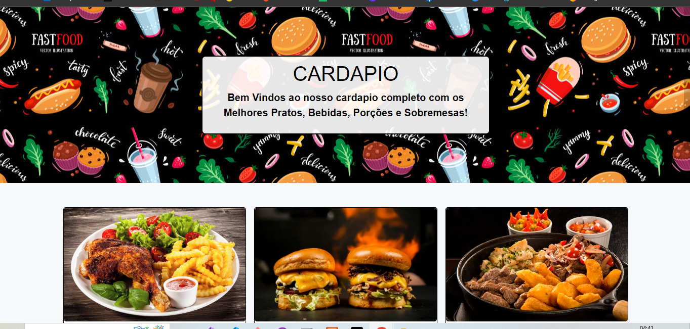
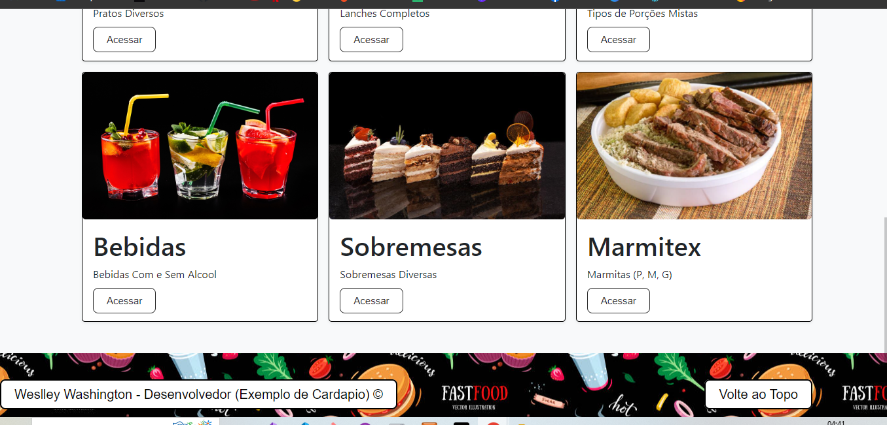
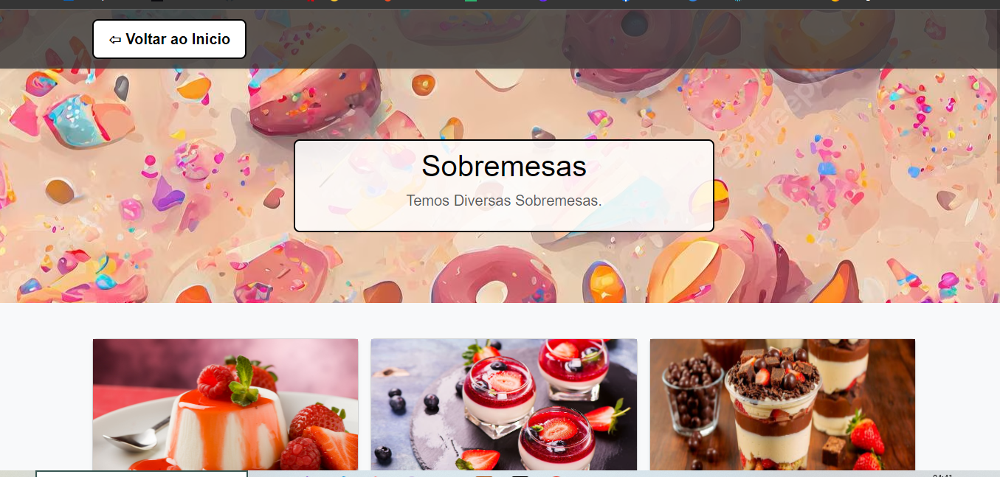
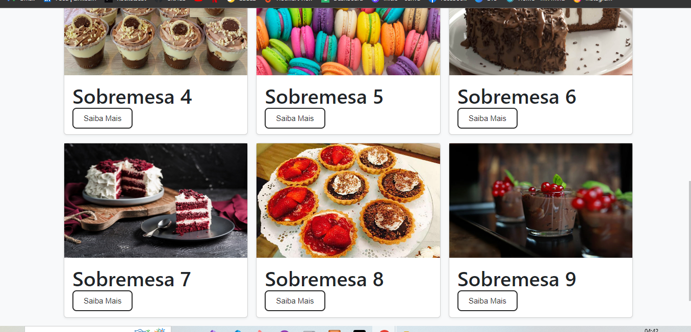
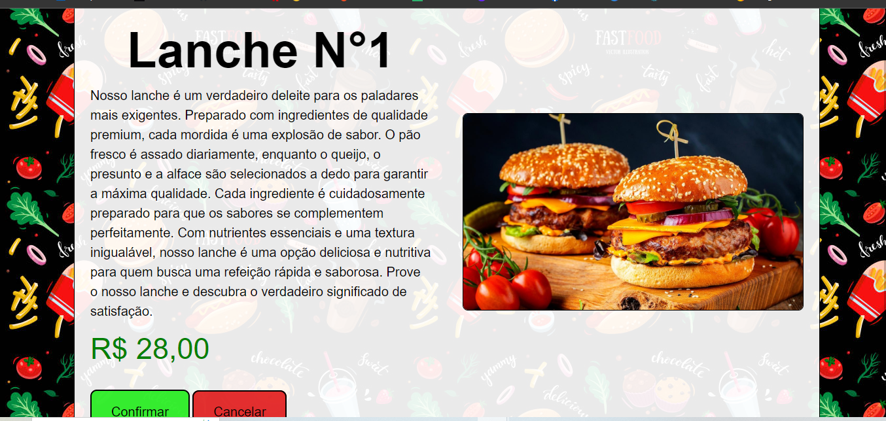

# Cardapio de um Bar - Projeto Web/Mobile da ETEC 

## Uma criação de um Cardapio para um projeto para o curso de Desenvolvimento Web e Mobile.

## Nesse cardapio temos 6 pratos principais e acessando voce tem de 6 a 9 variedades dos pratos ou bebidas, e acessando cada um você é redirecionado para a descrição do prato e o valor, confirmando a compra ou cancelando!

## - Inicio do Cardapio!

## - Inicio do Cardapio parte 2!

## - Exemplo de entrada da Sobremesa!

## - Mostrando a Variedade dos Pratos de Cada Entrada!

## - Pagina com a descrição do pedido, valor e confirmar e cancelar compra!

## Ainda está em Manutenção, estou colocando novas funcionalidades com o tempo e estou criando ele domeu jeito, estou colocando coisas que acho que possam ser interessantes na tematica e que atenda as necessidades!