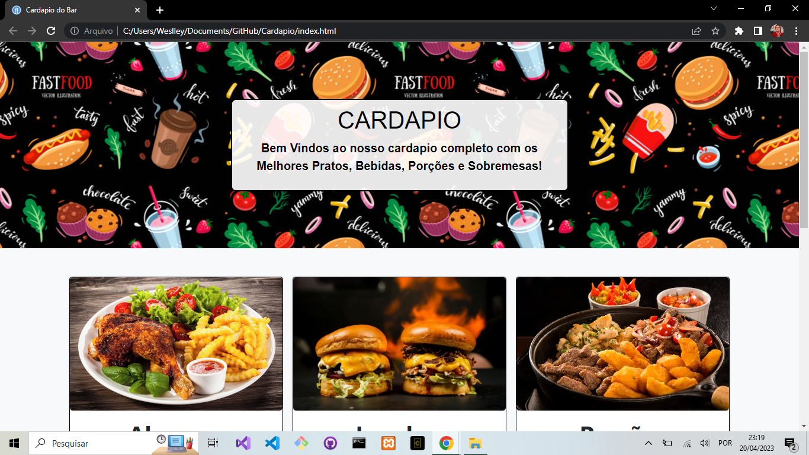
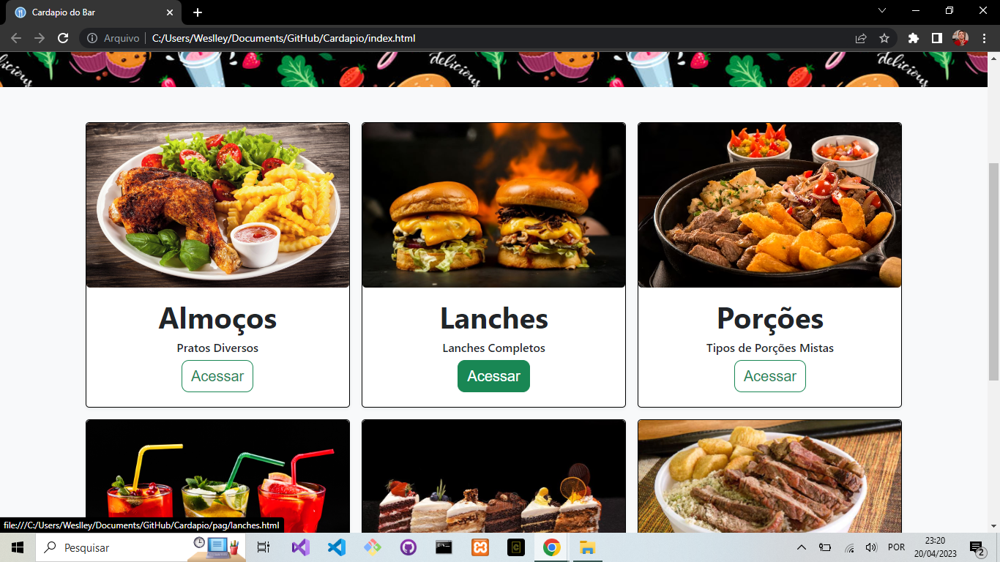
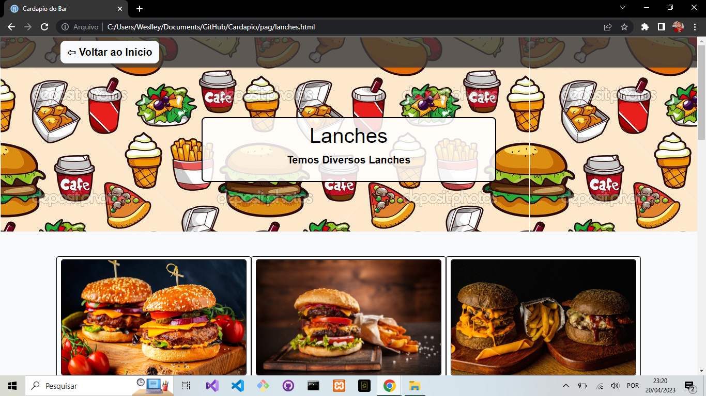
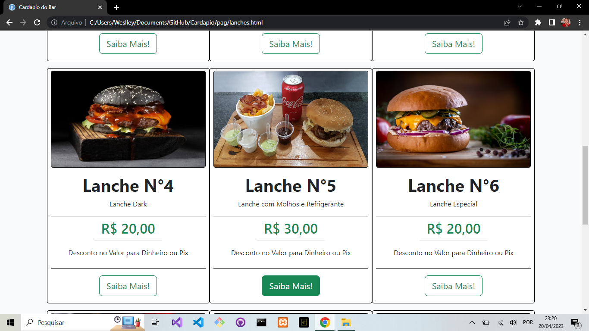
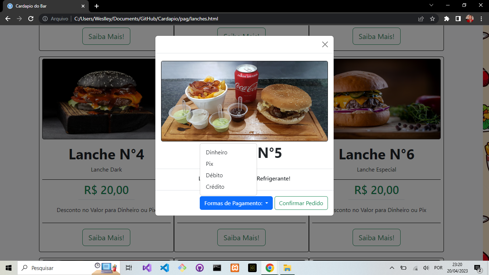

# Cardapio de um Bar - Projeto Web/Mobile da ETEC 

## Uma criação de um Cardapio para um projeto para o curso de Desenvolvimento Web e Mobile.

## Nesse cardapio temos 6 pratos principais e acessando voce tem de 6 a 9 variedades dos pratos ou bebidas, e acessando cada um você é redirecionado para a descrição do prato e o valor, confirmando a compra ou cancelando!

## - Inicio do Cardapio!

## - Inicio do Cardapio Apresentação dos Pratos!

## - Exemplo de entrada Lanches!

## - Mostrando a Variedade dos Pratos de Cada Entrada com Botão Personalizado!

## -Abertura de uma tela no centro ao Clicar em "Saiba Mais!"!

## Projeto de Cardápio com um Toque Profissional com botões interativos, telas separadas para cada tipo de pedido, com opções de formas de pagamento, ao Clicar em "Saiba mais!" aparece uma tela pequena com a descrição do pedido e a confirmação, junto com a forma de pagamento.

## Ainda está em Manutenção, estou colocando novas funcionalidades com o tempo e estou criando ele domeu jeito, estou colocando coisas que acho que possam ser interessantes na tematica e que atenda as necessidades!